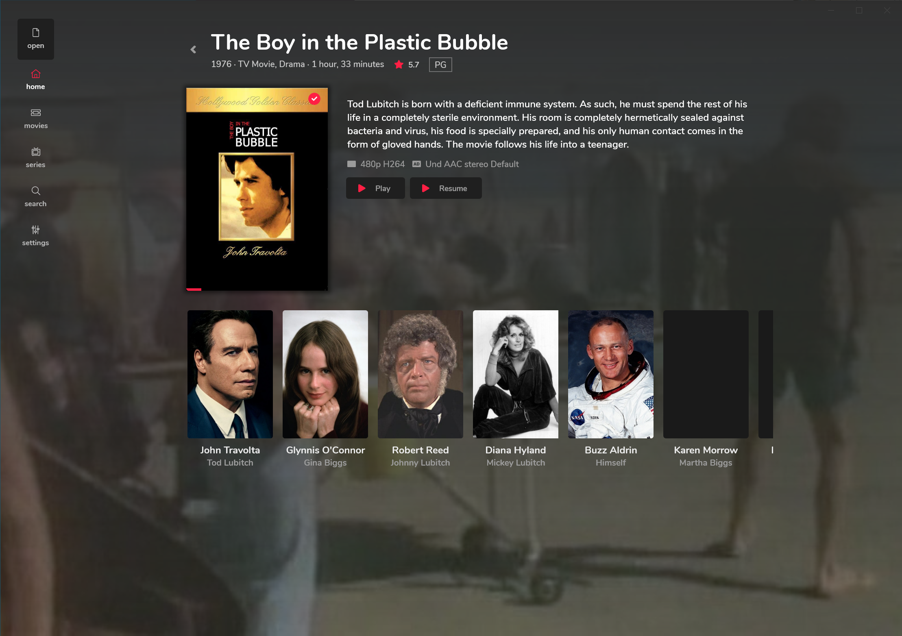

Videotape is a free lightweight video player for both Windows 10 & Xbox. Their new 3.0 version now supports Jellyfin!

{/* truncate */}

Videotape is a native UWP application with a strong focus on design and usability.

- Direct play almost all files, both from Jellyfin and other local files
- Overlay and always on top modes
- Adjustable playback speed

Download it now from the Microsoft store!

:::caution Update 2022-09-14

Unfortunately this client is no longer available on the Microsoft store.

:::

Here's what Jellyfin looks like on Windows, with Videotape 3.

Here's what it looks like on the Xbox One.

> Client Spotlight
>
> This blog series aims to highlight some of the amazing projects created by our community.
>
> Feel free to send a message if you can think of a project that could use more love!
