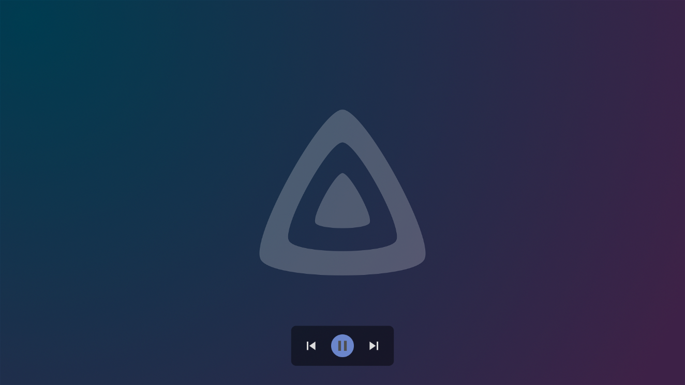

import { ImgComparisonSlider } from '@img-comparison-slider/react';

I'm excited to announce the third and final release of 2022 for the Android TV app. While this release mostly includes
internal changes, there are still a few new features to highlight. Keep reading to learn more about what's new.

\- Niels

{/* truncate */}

## Highlights

While you may not notice them directly, we have made numerous improvements to the underlying technology of the app in
this release. These changes make the app more stable and easier to maintain. Some of these changes are being
implemented in preparation for future updates, while others involve restructuring or updating older code. The app will
crash less frequently as a result of these changes. Some other notable changes in this release include:

### New picture viewer

Jellyfin is a media server that not only supports audio and video, but also pictures. In this release, we have improved
the picture viewer by adding on-screen controls. Previously, there were no controls displayed on the screen, which
caused confusion for many users. The new controls make it easier to navigate between pictures and start/stop a slideshow.

### Player changes

We have added a few new features to the video player in this release. There is now a "previous" button that allows you
to quickly go back to a previous episode or playlist item. Additionally, there is a new "quality" button that allows
you to adjust the maximum bitrate during playback. Finally, there is a new option called "audio night mode" which
normalizes the sound in a video. This option is turned off by default.

We have also enhanced the subtitle customization feature in this release to give you even more control over the
appearance of your subtitles. In addition to being able to adjust the size and enabling a background, you can now also
change the stroking width, position, and text color. This allows you to fine-tune the appearance of the subtitles to
better match your preferences.

### RTL support

<ImgComparisonSlider className='margin-bottom--md'>
  
  
</ImgComparisonSlider>

Previously the app could be difficult to understand or display incorrectly. By adding right-to-left (RTL) support, the
app now displays UI elements in the correct direction, making it more accessible and user-friendly. The app
automatically switches based on the used language.

## Contributors

Jellyfin apps are developed by our great contributors and we couldn't do it without them. Everyone is a volunteer that
doesn't get paid by any organizations, so consider donating if you appreciate their work. A big shout-out to all
contributors that made this release possible:

**Jellyfin Team**

- [@nielsvanvelzen](https://github.com/nielsvanvelzen) - Sponsor via [GitHub sponsors](https://github.com/sponsors/nielsvanvelzen)
- [@mueslimak3r](https://github.com/mueslimak3r) - Sponsor via [GitHub sponsors](https://github.com/sponsors/mueslimak3r)

**Other contributors**

- [@teobaranga](https://github.com/teobaranga)
- [@hadicharara](https://github.com/hadicharara)
- [@robertduplock](https://github.com/robertduplock)
- [@sparky3387](https://github.com/sparky3387)
- [@zkhcohen](https://github.com/zkhcohen)
- [@kevgrig](https://github.com/kevgrig)
- [@Andy2244](https://github.com/Andy2244)
- [@sunrisela](https://github.com/sunrisela)
- [@DenizenB](https://github.com/DenizenB)
- [@The\-Randalorian](https://github.com/The-Randalorian)

## Downloads & changelog

The complete list of changes for this release, including all merged pull requests, can be found on
[GitHub](https://github.com/jellyfin/jellyfin-androidtv/releases/tag/v0.15.0).

Direct downloads are available for sideloading at [repo.jellyfin.org](https://repo.jellyfin.org/releases/client/androidtv/)
or in the [GitHub release assets](https://github.com/jellyfin/jellyfin-androidtv/releases/tag/v0.15.0).
You can also join our [beta program on Google Play](https://play.google.com/apps/testing/org.jellyfin.androidtv) and
help test new versions before they're released to the public.
