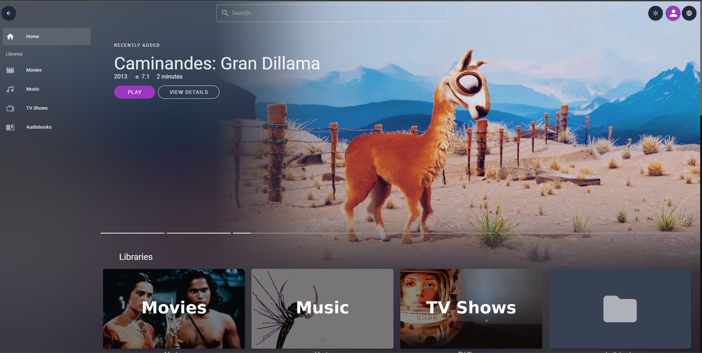
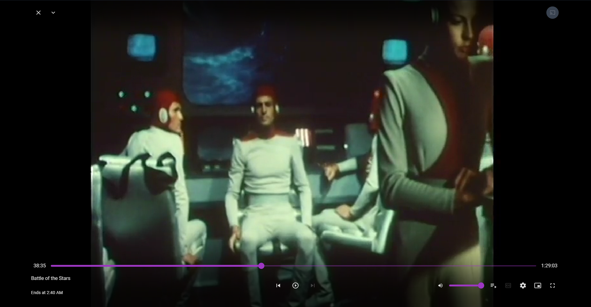

import { ImgComparisonSlider } from '@img-comparison-slider/react';

280 commits, +28000 lines added, +43000 lines removed since November 2022: The results of the biggest refactor we ever tackled
and an ecosystem upgrade we've been looking forward since we started working on this client on 2020.

- Fernando

{/* truncate */}

*Don't know what Jellyfin Vue is? Skip to **What's Jellyfin Vue?** section. What's below is a rather technical explanation*

When we started working on this client, we used Nuxt and Vue 2, even when Vue 3 was right around the corner.
Nuxt has been an amazing tool to scaffold our project, and get started into the Vue ecosystem.
It even allowed us to play with SSR. However, it forced a really rigid structure on us, besides
[SSR turned out to be a burden](https://github.com/jellyfin/jellyfin-vue/discussions/1620).
We had even to use some hacks to avoid killing playback while transitioning between pages.

As part of our Vue 3 migration, we switched to an standard Vue 3 project structure
(Vue 3, Vite, TypeScript and, in the future, Vitest), which allowed us to remove many of the hacks
and legacy code we used to overcome Vue and Nuxt 2 limitations. Beside that, Vue 3
only supports ES6-compatible browsers. We also use [some syntax](https://github.com/jellyfin/jellyfin-vue/blob/master/frontend/src/main.ts#L2)
that's only compatible with ES2022. All of this means that, as part of this upgrade, **we also deprecated all legacy support for outdated browsers**.
That include the majority of TVs. **Chrome/Edge/Firefox/Safari, both in desktop and mobile platforms are still fully compatible**.
If the web browser of your device still gets updates, it'll likely have no issues running Jellyfin Vue.

Although the affected userbase will probably be small, I'm sorry for those who might be affected by this decision but,
given our limited resources, looking forward is our only way to go if we want to provide the best alternative web client for Jellyfin.
You can still run the pre-Vue3 version (go to *Downloads & changelogs* to know more), although it will not receive any support from us.

### A note on privacy 🕵🏻

[I wrote an small disclaimer explaining how Jellyfin Vue (and Jellyfin Web) works](https://github.com/jellyfin/jellyfin-vue#privacy-disclaimer-),
since I saw a lot of misconceptions about how our hosted instance works and how connections from Jellyfin apps to the Jellyfin server works.

Please, give it a read!

## 👥 Contributors

Jellyfin apps are developed by our great contributors and we couldn't do it without them. Everyone is a volunteer that
doesn't get paid by any organizations, so consider donating if you appreciate their work. A big shout-out to all
contributors that made this possible:

**Jellyfin Team**

- [@ferferga](https://github.com/ferferga) - Sponsor via [GitHub sponsors](https://github.com/sponsors/ferferga)
- [@ThibaultNocchi](https://github.com/ThibaultNocchi)

**Other contributors**

- [@Janbong](https://github.com/Janbong)
- [@aweebs](https://github.com/aweebs)

## 💾 Downloads & Changelog

As part of this upgrade, we created 3 releases:

* [v0.2.0](https://github.com/jellyfin/jellyfin-vue/releases/tag/0.2.0): This is the last release powered by Vue 2.
* [v0.3.0](https://github.com/jellyfin/jellyfin-vue/releases/tag/0.3.0): This is the first release powered by Vue 3. This was tagged right after we merged the branch we've been working on these past months.
* [v0.3.1](https://github.com/jellyfin/jellyfin-vue/releases/tag/0.3.1): Same as v0.3.0, but after all the pending dependency updates have been merged.

---

# What's Jellyfin Vue?

Jellyfin Vue is an alternative web client some of us started working on in 2020. Jellyfin Web had a lot of maintenability
problems, so we thought it might be a good idea to start a new client with modern web development technologies in its stack
and use it as a playground for testing some cool features that might not make the cut (or would've been impossible to make)
in Jellyfin Web.

<ImgComparisonSlider className='margin-bottom--md'>
  
  
</ImgComparisonSlider>

Head over [our GitHub repo](https://github.com/jellyfin/jellyfin-vue) to know more about it and see how you can use it!

---

# What's next?

We [have a roadmap](https://github.com/jellyfin/jellyfin-vue/discussions/1679) with what we want bring up next:
a media-type driven design, where your media feels at home every time. The current approach of most Jellyfin clients
is to be too generic in order to be suitable for all media types possible, but when you're listening to music you
don't feel you're in a music player (like Spotify) or in Netflix when watching TV Shows and Movies

There's also an [approximate schedule](https://github.com/jellyfin/jellyfin-vue/projects/4) to better sort
our priorities.
