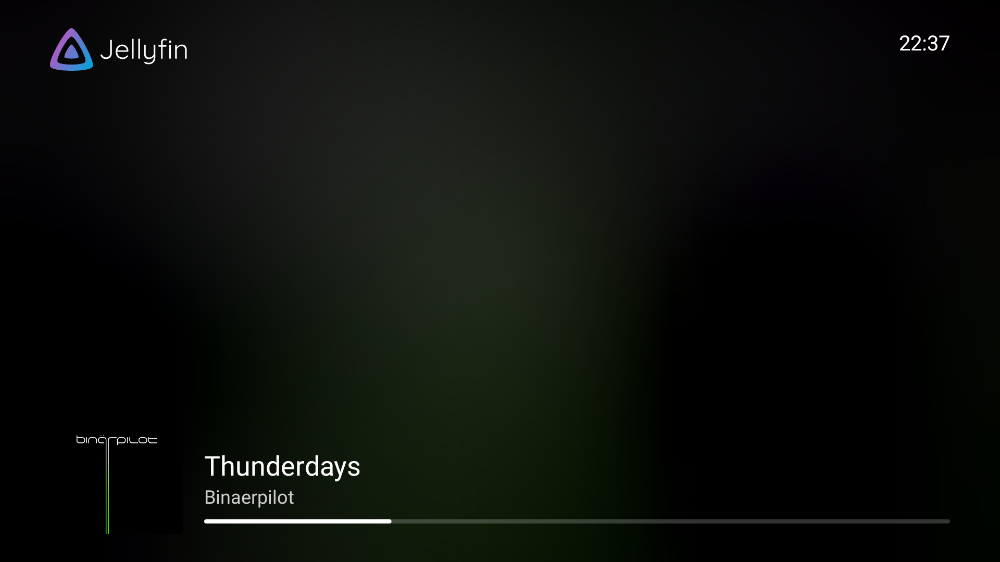
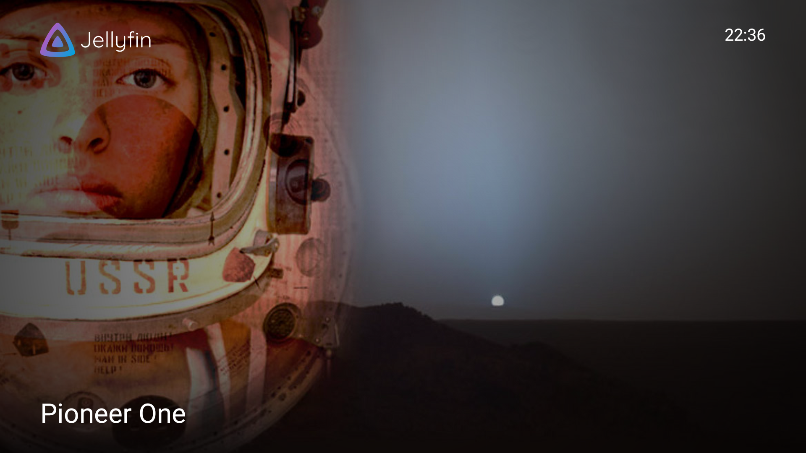
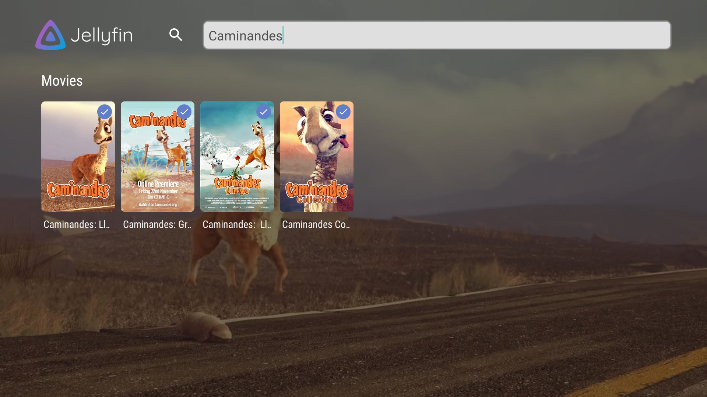

It has been a busy year with a lot of work on the Android TV app. After an extended beta period today is finally the day to share this work
to the public. Read along to learn everything about improved music playback, the new screensaver and more!

\- Niels

{/* truncate */}

## Significant changes

In this post I will focus on a few of the popular and significant changes. As always, a lot more changes were made both visible and
invisible; check out the full changelog to discover the full extent of this release.

### Music playback

Playing media is the key feature of Jellyfin. Up until now the Android TV app had many issues playing every possible format. The code
was also hard to work with making it challenging to fix the issues or implement new features. To counter this we decided to rewrite all
playback code completely from scratch. In this release the initial results are ready for daily use and playing music will use the new
playback code!

While a lot of this work is not directly noticable when using the app, some of it is. Crashes should now be uncommon, starting music is
faster and the remote control now responds more reliably. We've also added media sessions, this allows you to play/pause from other
applications on your TV or even your smartphone!

Improved codec detection should reduce transcoding and use direct play more often resulting in faster playback with less strain on the
Jellyfin server. We already have plans to improve this even more and add preferences to fine-tune this for your specific devices. Other
planned features include showing lyrics, enabling SyncPlay and gapless playback support.

Work has already started to rework video playback based on this new code so we can add all kinds of new features with ease in a shared
code base for both video and audio playback.

### Screensaver

The screensaver has received some nice additions. It was redesigned to be faster, with better animations and a much nicer appearance.
Alongside this redesign, new functionality was added. Music playback has been added to the screensaver, replacing the old screensaver from
the 'now playing' screen. Additionally, the screensaver is now enabled by default when the app is open, eliminating the need to enable it
system-wide.

And the best part: the screensaver now works when the video player is paused!

### Search

The search screen was partially rewritten to improve performance. It will now cancel any pending search requests while typing and use
a different method for getting the results. With these changes, a search on a large server is now noticeably faster and no flickering
occurs anymore.

### Full release notes

The complete list of changes (over one hundred!) for this release, including their respective pull requests, can be found on
[GitHub](https://github.com/jellyfin/jellyfin-androidtv/releases/tag/v0.16.0).

## Contributors

Jellyfin is developed by volunteer contributors, and we couldn't do without their great skills and dedication. They don't get paid by any
organizations, so consider donating if you appreciate their work. A big shout-out to all contributors that made this release possible:

**Jellyfin Team**

- [@nielsvanvelzen](https://github.com/nielsvanvelzen) - Sponsor via [GitHub sponsors](https://github.com/sponsors/nielsvanvelzen)
- [@thornbill](https://github.com/thornbill) - Sponsor via [GitHub sponsors](https://github.com/sponsors/thornbill)
- [@1337joe](https://github.com/1337joe) - Sponsor via [GitHub sponsors](https://github.com/sponsors/1337joe)

**Other contributors**

- [@DoggoOfSpeed](https://github.com/DoggoOfSpeed)
- [@DavidFair](https://github.com/DavidFair)
- [@Clubfan22](https://github.com/Clubfan22)
- [@MWisBest](https://github.com/MWisBest)
- [@teobaranga](https://github.com/teobaranga)
- [@tim-vk](https://github.com/tim-vk)
- [@OctoNezd](https://github.com/OctoNezd)
- [@polson](https://github.com/polson)
- [@mohd-akram](https://github.com/mohd-akram)
- [@horizon1250](https://github.com/horizon1250)
- [@reacocard](https://github.com/reacocard)

We'd also like to thank everyone who reported bugs, provided feedback and participated in beta testing! The feedback we received made this
our most stable release to date.

### Helping out

If you have some experience with Android TV development or with Kotlin and are interested in contributing yourself,
feel free to dive into the source code [on GitHub](https://github.com/jellyfin/jellyfin-androidtv) and open pull requests.

Alternatively, you can help with translating the app into your language on our
[Weblate](https://translate.jellyfin.org/engage/jellyfin-android/) instance.

## Downloads

Update your app now to check out all these changes! The app stores will auto-update your Jellyfin app if you're already using the app. For
new users, you can find the app here:

Direct downloads are available for sideloading at [repo.jellyfin.org](https://repo.jellyfin.org/releases/client/androidtv/)
or in the [GitHub release assets](https://github.com/jellyfin/jellyfin-androidtv/releases/tag/v0.16.0).

You can also join our [beta program on Google Play](https://play.google.com/apps/testing/org.jellyfin.androidtv) and help test new versions
before they're released to the public.
