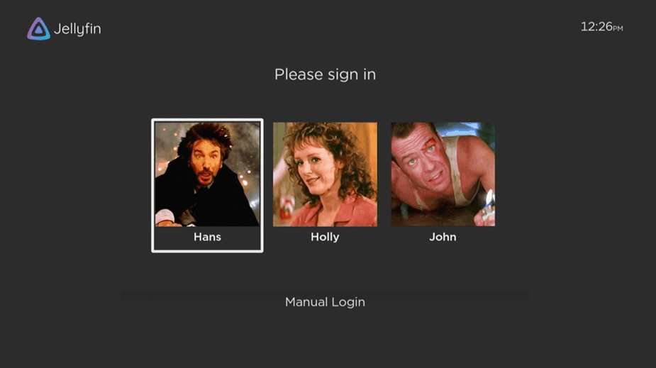
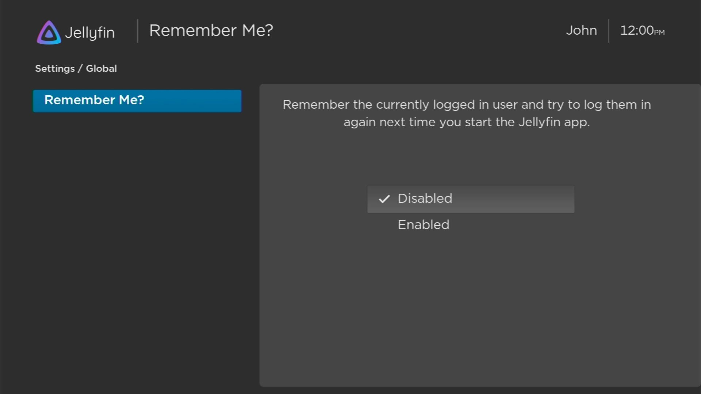
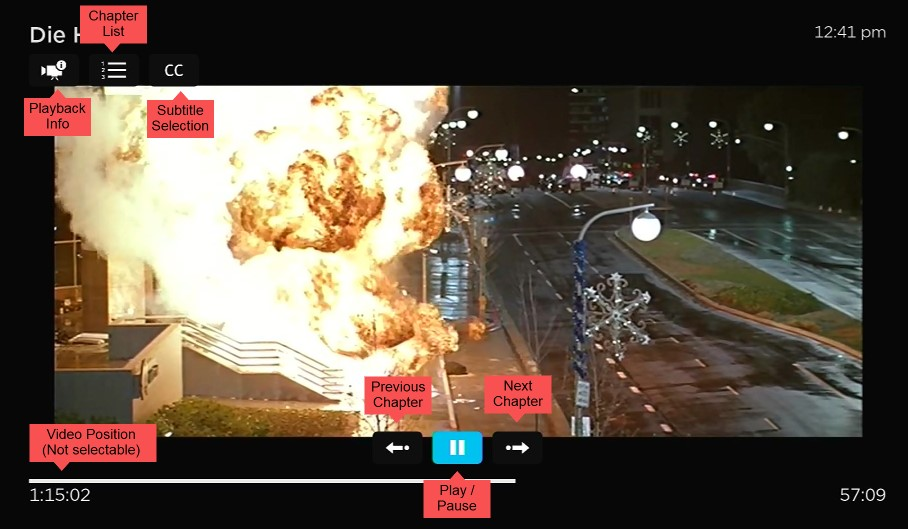
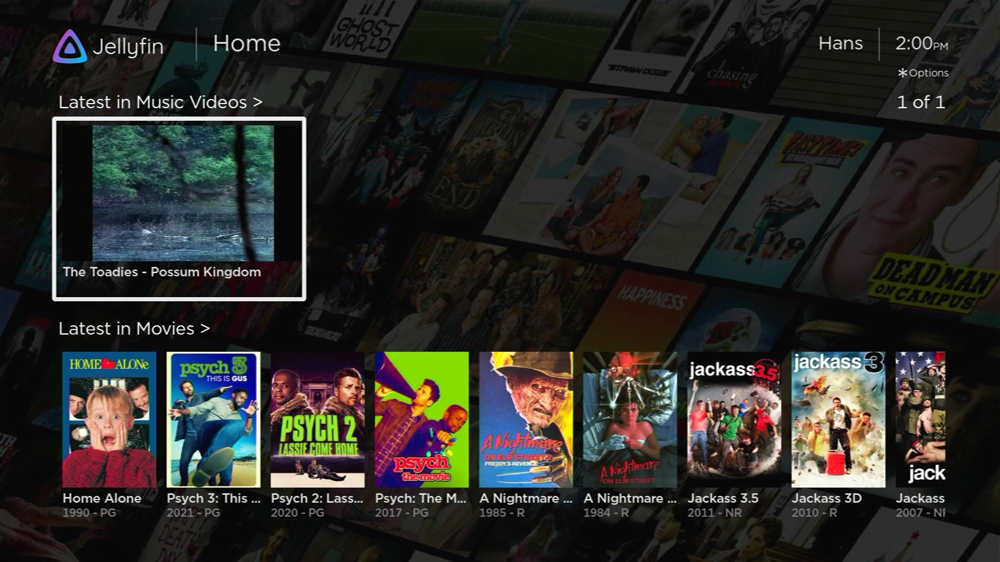
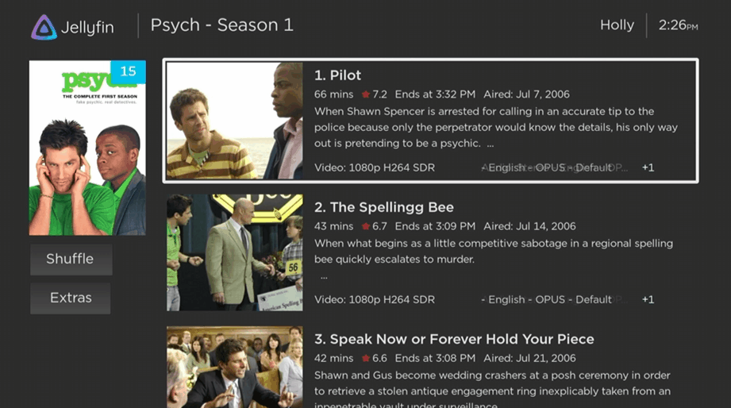
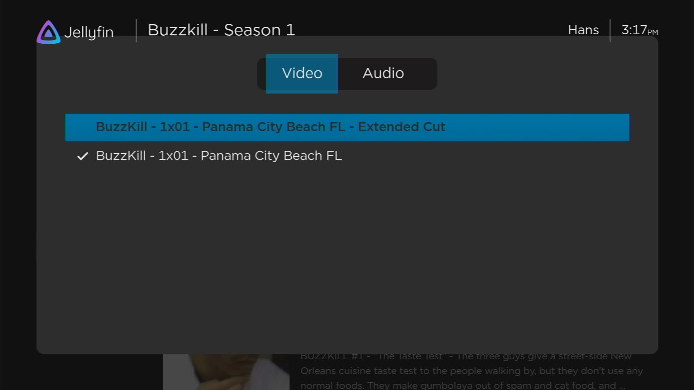
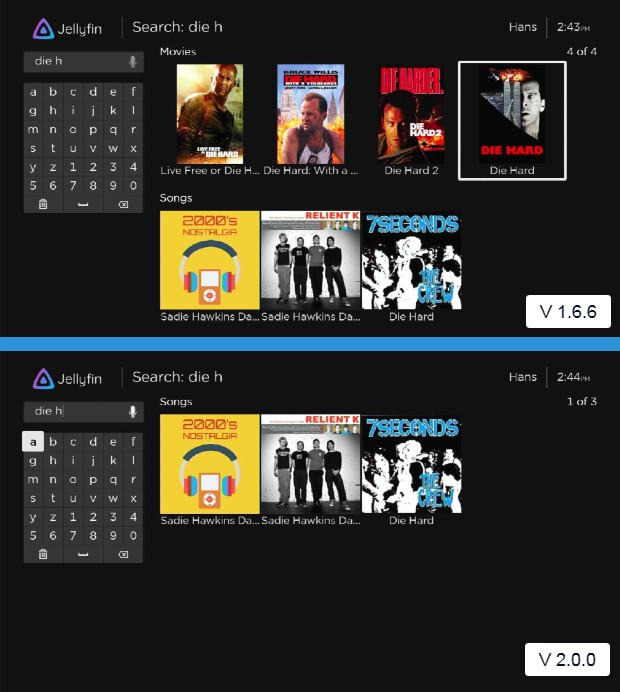
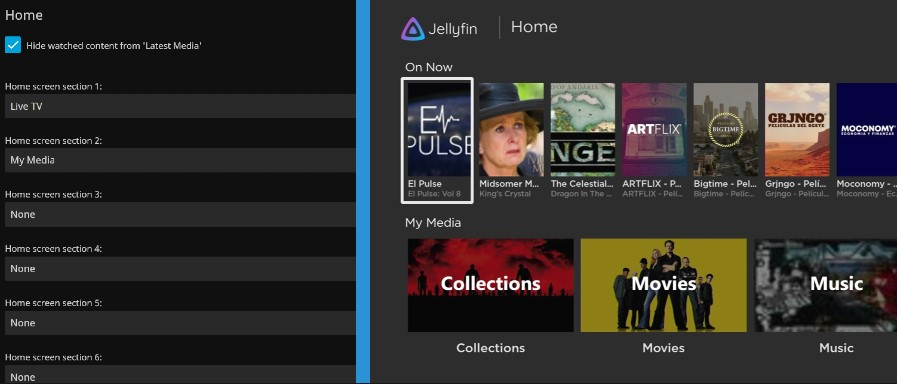

When we say this 2.0.0 release is a major milestone, we honestly mean it. New features and bug fixes abound, but even behind the scenes the updates continue all the way to the foundation with us updating every single file in the app to support a new programming language. You can't get more monumental than that!

Read more to learn about some of the exciting new features.

\- 1hitsong

{/* truncate */}

### 👥 User Select Screen / Auto Login

When launching the Jellyfin app, it now presents you with the list of public users and any private users with saved credentials for you to login as.

If you prefer to have the app automatically login as a specific user, simply login as them and enable the new global Remember Me setting. With this global setting enabled, the app will automatically login as this user at the start of the Jellyfin app without needing to select them or enter a password.

**Note:** Users upgrading from 1.6.6 will automatically have this global setting enabled and will automatically login as the last user logged in to the 1.6.6 app.

Additionaly the code behind the login form has been updated to remove several annoying bugs. Unlike before, access for all remembered users will continue to work even when other users log in and out. Also, the What's New popup will now appear for all users on their 1st login of a new app version.

### 🎥 On Screen Display (OSD)

The new OSD provides quick access to the new chapter navigation functions, and is also the new way to access the playback info and subtitle section popups. This is only the start for the OSD. We have a lot of new and exciting functions we will be adding in the future!

To access the menu simply press either UP, DOWN, OK, or PAUSE while in the video player. Like we said, the menus you previously accessed by pressing UP or DOWN are now available from the OSD.

**Note:** The video position bar is not currently selectable from the OSD. It is informational only for now.

If you want to step through the video position, simply press LEFT or RIGHT when the OSD is not on the screen, just like it's always been before. Rewind and Fast Forward also operate the same way. Simply press the button on the remote when the OSD is not shown.

### 🎸 Music Video Support

Support for Music Videos has been added. If the user has access to the Music Videos library, it will appear in the My Media section and the Latest videos will show on the home view.

### 🏎️ Quickplay Support Expanded To Entire App

Stop wasting time and get your media playing ASAP!

Quickplay support is now across the entire app. Simply highlight an item and press play on your remote. The client will then queue up to 2000 items and start playing.

TV season? Check. Playlist? Check. Your favorite actor? Check. Your music library for a week long rager? Ya' better believe check.

### 📺 TV Show Season Extras Support

You can now access TV show season extras in the Jellyfin Roku app. Simply navigate to a season of a TV show and if Jellyfin has found extras, a new button labeled Extras will appear on the left side of the screen under the Shuffle button. Clicking it will toggle between viewing a list of episodes and a list of extras. Simply click on an extra to start watching.

### 📺 TV Episode Version Support

Have different versions of a TV episode? You can now select and watch the version you want. On the list of episodes, highlight the episode you want and press * on your remote. The option popup now provides not only audio options, but also version options.

**Note:** If one of the Videos has different audio options, the user must select the desired video version, exit options, then press * again to see the updated audio options.

**Note:** As of this writing, the only way to generate episode versions is in the Android app or using the API.

### 🔍 Search Honors Library Permissions

Search in Roku now honors library access permissions. If a user doesn't have access to a library, items in that library are no longer returned in search results.

The screenshot above shows what search results look like if a user does not have access to the movie library.

### 🔢 Use Web Client's Home Section Arrangement Setting

A new setting has been added under User Interface > General > Use Web Client's Home Section Arrangement. This setting causes the order of the home sections in the Roku app to match the order of the home sections as set in the server settings.

## ...and on, and on, and on

- Native support for the AV1 codec (no more user setting)
- Boxsets now sorted by release date by default
- View your music library by Album Artists
- Custom subtitle support (required for CJK support) expanded
- Alpha menu now wraps from bottom to top & top to bottom
- When connecting to a new server, automatically attempt connection using default protocols and ports if not specified
- Updated loading spinner similar to the video player spinner
- Use TV show posters (if available) instead of channel posters for the \"On Now\" home section
- Device Profile has been rewritten and improved
- Improved \"Next Episode\" button logic
- Movie and music libraries now sorted A to Z by default
- Fixed several bugs that could crash the app
- Many (oh so many) bug fixes

There are simply too many amazing things in this release to name them all! To read the full list of changes, please read the full [release notes](https://github.com/jellyfin/jellyfin-roku/releases/tag/v2.0.0).

## 👥 Contributors

Jellyfin apps are developed by our great contributors and we couldn't do it without them. Everyone is a volunteer that
doesn't get paid by any organizations, so consider donating if you appreciate their work. A big shout-out to all
contributors that made this release possible:

**Jellyfin Team**
- [@1hitsong](https://github.com/1hitsong) - Sponsor via [GitHub sponsors](https://github.com/sponsors/1hitsong)
- [@cewert](https://github.com/cewert) - Sponsor via [GitHub sponsors](https://github.com/sponsors/cewert)
- [@jimdogx](https://github.com/jimdogx)
- [@neilsb](https://github.com/neilsb)

**Other contributors**
- [@alanazar](https://github.com/alanazar)
- [@ApexArray](https://github.com/ApexArray)
- [@arturocuya](https://github.com/arturocuya)
- [@candry7731](https://github.com/candry7731)
- [@iBicha](https://github.com/iBicha)
- [@JarodTAerts](https://github.com/JarodTAerts)
- [@Klikini](https://github.com/Klikini)
- [@matty-r](https://github.com/matty-r)
- [@pau1h](https://github.com/pau1h)
- [@photonconvergence](https://github.com/photonconvergence)
- [@sevenrats](https://github.com/sevenrats)
- [@tharvik](https://github.com/tharvik)

## 💾 Downloads & Changelog

Requires minimum server version of 10.8.1

The complete list of changes for this release, including all merged pull requests, can be found on
[GitHub](https://github.com/jellyfin/jellyfin-roku/releases/tag/v2.0.0).

Your installed Jellyfin channel should automatically update once available or you can install Jellyfin 
from the [Roku store](https://channelstore.roku.com/details/592369/jellyfin).
