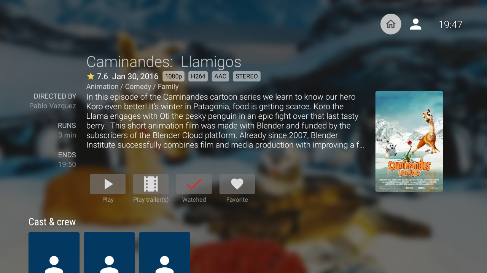

The latest Android TV app release features enhanced stability, improved navigation with a new home button, and an updated screensaver with
age rating filters. Check out the full blog post to see all the new features and update now!

{/* truncate */}

## Notable changes

This release comes with over 100 changes from 13 contributors. The complete list of changes, including their respective pull requests, can
be found on [GitHub](https://github.com/jellyfin/jellyfin-androidtv/releases/tag/v0.17.0). I've listed the most important/noticeable changes
below.

### Navigation

It might seem like just one button, but it solves a significant issue. A new 'home' button in the top-right corner lets you return to the
Jellyfin home screen easily, instead of pressing the back button repeatedly. Additionally, the layout of the item details has been slightly
tweaked to fit more useful information.

### Playback

The current video player was improved by adding support for more audio codecs, including WAV, Vorbis and PCM. Additionally, timeouts for
player errors were increased to give transcode and remux tasks more time to start. This improves playback for media stored on network
drives and BDMV files that require unpacking.

Audio normalization support was added to automatically adjust volume levels for music playback. This feature prevents sudden volume changes
between songs. To activate this feature, you'll need to enable the LUFS scan for your music library.

### Screensaver

The screensaver now includes a feature to filter items based on their age rating. By default, only items with an age rating up to 13 will
be displayed, ensuring a family-friendly environment. Age rating options can be changed in the preferences under the customization tab.

Additionally, the screensaver has been enhanced to display a logo of the movie or series being shown.

### Other changes

Series and seasons now display their respective special features, which were previously available only for movies. Additionally, the search
function has been improved to include results for Live TV channels, playlists, collections, photo albums, and individual photos.

Invisible but noteworthy, a significant amount of work was invested in reworking the communication between the app and the server. This
has resulted in a faster and more reliable app, with improved performance and the groundwork laid for the development of exciting new
features. As a consequence of these changes, the app now requires Jellyfin 10.9 or newer and older versions are no longer supported.

## Contributors

Jellyfin is completely developed by volunteers, and we couldn't do without their great skills and dedication. Consider donating if you
appreciate their work. A big shout-out to all contributors that made this release possible:

**Jellyfin Team**

- [@nielsvanvelzen](https://github.com/nielsvanvelzen) - Sponsor via [GitHub sponsors](https://github.com/sponsors/nielsvanvelzen)
- [@Bond\-009](https://github.com/Bond-009) - Sponsor via [GitHub sponsors](https://github.com/sponsors/Bond-009)

**Other contributors**

- [@pascalwei](https://github.com/pascalwei)
- [@haydenzeller](https://github.com/haydenzeller)
- [@DoggoOfSpeed](https://github.com/DoggoOfSpeed)
- [@bathompson](https://github.com/bathompson)
- [@VizuaaLOG](https://github.com/VizuaaLOG)
- [@3l0w](https://github.com/3l0w)
- [@mnsrulz](https://github.com/mnsrulz)
- [@MichaelRUSF](https://github.com/MichaelRUSF)
- [@efreet7](https://github.com/efreet7)
- [@ConnorS1110](https://github.com/ConnorS1110)
- [@cbeyls](https://github.com/cbeyls)

We'd also like to thank everyone who reported bugs, provided feedback and participated in beta testing!

### Helping out

If you have experience with Android TV development or with Kotlin and are interested in contributing yourself, feel free to dive into the
[source code](https://github.com/jellyfin/jellyfin-androidtv) and open a pull request.

Alternatively, you can help with translating the app into your language on our
[Weblate](https://translate.jellyfin.org/engage/jellyfin-android/) instance.

## Downloads

Update your app now to check out all these changes! The app stores will auto-update your Jellyfin app if you're already using the app. For
new users, you can find the app here:

Direct downloads are available for sideloading at [repo.jellyfin.org](https://repo.jellyfin.org/releases/client/androidtv/)
or in the [GitHub release assets](https://github.com/jellyfin/jellyfin-androidtv/releases/tag/v0.17.0).

You can also join our [beta program on Google Play](https://play.google.com/apps/testing/org.jellyfin.androidtv) and help test new versions
before they're released to the public.
