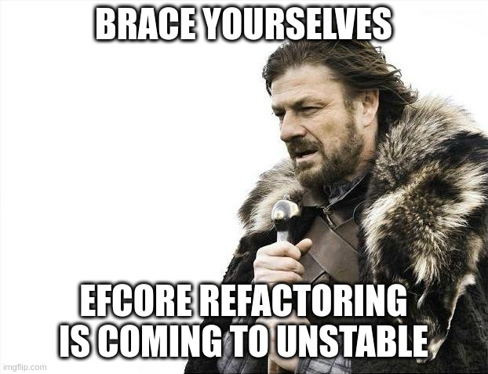

**Unstable users: we are planning to merge our pending EFCore conversion of `library.db` in the next couple of weeks. It is imperative that all unstable users understand what is going on, what the plan is, and how to mitigate issues that will inevitably arise from this.** Stable (`10.y.z`) users require no action.

Unstable builds are currently paused for roughly 4 weeks post-release of 10.10.0, and during this time, we plan to merge these extensive database changes. There will be breakage - bugs, fixes, and database migrations - during this time. This is your fair warning to either (a) prepare yourself with [a good backup and recovery strategy](/docs/general/administration/backup-and-restore) and disable automatic upgrades; or (b) move off of unstable onto 10.10.0 stable until the dust settles (but, please don't, as we need your help to test!)

Please read on for a more detailed overview if you are interested.

\- Joshua

{/* truncate */}

## What is EFCore, and why are we migrating to it?

EFCore is the C#/.NET database handling framework, which simplifies database query handling in the Jellyfin codebase.

Our original database code was written by Emby in a time long before .NET Core existed, when Mono ruled the world in terms of cross-platform C# compatibility. As such, it handled the database poorly: SQLite queries embedded directly in the code, and a fairly horrific schema with no migration capabilities. This has caused us a lot of problems over the years as we try to change and improve the codebase and add new features, and as such, the team began migrating to EFCore quite a while ago.

We were able to move many of the databases quickly, mostly due to the diligent work of [@BarronPM](https://github.com/barronpm); those have been live for several major releases now. But the Library database has remained as it was, due to its massive complexity and exceptionally poor schema. This has caused a lot of problems, for instance very slow search, problems adding new media types (or deprecating old ones), and lots of complexity inside the codebase around handling "non-standard" (i.e. not Movies/TV Shows/Music Albums) media types, resulting in bugs.

Now, thanks to [@JPVenson](https://github.com/JPVenson), we finally have the library database EFCore implementation ready to go. But there is a big catch.

## There Will Be Bugs

Once we merge this massive change set, there will be bugs. This is certain. And these bugs may completely trash your library database. So first and foremost, it is incredibly important that everyone running the Unstable builds understands that this is coming and how to prepare yourself.

## What we will be focusing on

Our primary goal will be to ensure that stable-to-stable migrations between 10.10.x and 10.11.x will work without a hitch, as we want and need this transition to be as seamless as possible for the majority of users running stable builds when 10.11.0 drops.

But to do this, we need to both test the changes in unstable, and ensure that our migrations are valid for data coming from the 10.10.x stable.

The downside of this is, though, that we might not be able to cleanly implement unstable-to-unstable migrations in a way that will work properly. While we will try to do this, we cannot guarantee it.

## Our timeline

1. This blog post starts the process to provide the warning to all unstable users that this is coming. Note that as of posting, unstable builds are disabled due to the recent 10.10.0 release, and will remain off for a little while.

2. About 1-2 weeks after this blog post, we will merge the Library EFCore migration into our `master` branch and begin preliminary testing. If you want to help here, you will have to [build Jellyfin from source](/docs/general/installation/source), and the more people who can help here the better!

3. About 2 weeks after merging, assuming everything looks generally OK, we will **re-enable unstable builds for the general public**. At this point, all unstable builds will apply the initial migrations on startup. That will bring us to about 4 weeks (give or take a week) from the 10.10.0 release.

4. Over the following weeks, we will take bug reports and try to correct them. This is the possible sticking point: if it's not possible for us to implement a clean set of migrations, we may decide to only focus the migration on stable-to-unstable conversions, rather than unstable-to-unstable. If this happens, you may need to restore a previous version and apply the new migrations to it.

## What this actually means for you

First and foremost, if this is too much for you, this is your warning for the off-ramp. Switch away from unstable **now** before we restore the unstable builds in a few weeks.

Second, **ensure you have a robust backup strategy [based on our suggested backup process](/docs/general/administration/backup-and-restore)**. Take backups regularly, and, to help us test, try to also have a backup of your last stable release so you can run that through the migrations as well. Take backups **before** applying the next unstable build, every time.

Third, **ensure you disable automatic upgrades**. We generally recommend this anyways, but if you're still doing this, now is the time to stop.

Fourth, **if you run into trouble, please ensure you report the bug with a title containing `[EFCore Library]`**. This will help us find and fix the bugs.

Fifth and finally, **if you have a failing migration, restore an older database version first and try to re-run it**. If it still fails, try your oldest (ideally, 10.9.11 or 10.10.0 stable) backup as well. If *that* one doesn't work, it's a new bug to report.
