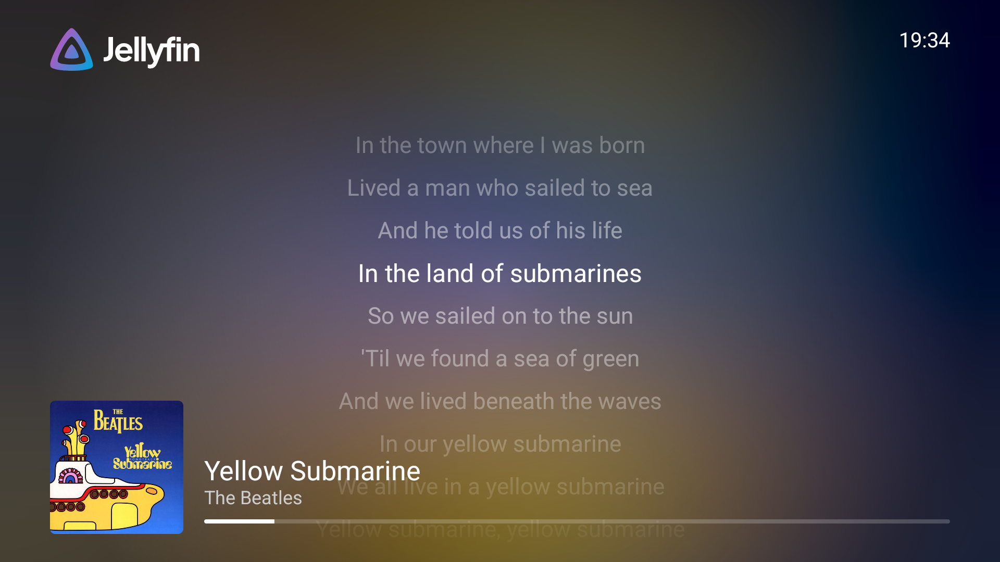
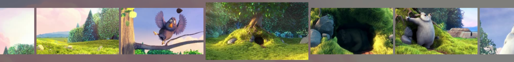

Version 0.18 of our Jellyfin for Android TV app is ready! Exciting features like lyrics and media segments are now available, along with
significant improvements to subtitles and more.

{/* truncate */}

This release marks another milestone in our journey to delivering the best media app on Android TV. Jellyfin 10.10 or newer is required. A
complete list of changes, including their respective pull requests, can be found on
[GitHub](https://github.com/jellyfin/jellyfin-androidtv/releases/tag/v0.18.0). I've listed a subset of all changes below.

### Skipping intros, outros and more with media segments

Media segments are a new feature added in Jellyfin 10.10. A segment provides metadata for specific parts of a video or audio file. This can
be used to mark an intro in your episode or the credits of a movie. The Android TV app can now use those segments to skip parts. By default,
the app will ask to skip intros and outros, but you can fine-tune this to your liking within the app preferences. All media segment types
are supported: intro, outro, preview, recap and commercial with three actions to choose from:

- **Skip**  
  Immediately skips the playback forward to the end of the segment, or the next episode

- **Ask to skip**  
  Shows a popup that the segment can be skipped by pressing the OK button on your remote and disappears after 8 seconds or when pressing the
  back button.

  

- **Do nothing**  
  The segment will be ignored, with no skips or popups.

More actions and functionality related to media segments is already in the works for future releases, like a "mute" action that temporarily
silences audio.

### Revamped subtitles

This release completely redesigns the way subtitles are loaded and shown on screen, resolving a large number of issues reported over the
past few years.

Previously the app did not support embedded subtitles and forced the server to extract them from video files first. This is a resource-heavy
process and often causes subtitles to not show up or with a big delay. A workaround for this was to use the "Subtitle Extract" plugin that
will do this extraction ahead of time, this was cumbersome and is now no longer necessary.

Together with these loading changes, the app now reliably supports Presentation Graphic Stream (PGS) subtitles and positioning tags in the
SubRip Subtitle Format (SRT), a much requested feature!

To make these changes happen, the preferences for subtitles have also slightly changed. It is now possible to choose your own background and
outline colors.

### Sing along with lyrics

Not only did video playback improve, playing music has gotten some upgrades as well! The most exciting change here is support for lyrics.
Whenever your song has lyrics available (added by a plugin or on your file system), they will be shown in the app. This works especially
well when combined with our screensaver, which will show lyrics fullscreen.

Currently, 2 types of lyrics are supported: timed lyrics, which will highlight the current line of the vocal track, and untimed lyrics,
which will automatically scroll based on the track duration.

In addition to the lyric changes, some bugs have been fixed where a music queue would never disappear when the last track ends and some text
elements did not update properly.

### Other changes

In addition to the previously mentioned changes there's a lot more to enjoy. The video player will no longer randomly show its controls and
they stay hidden when the video is loading for a smoother experience. An issue where sorting libraries by "last played" did not work for TV
shows was fixed. And finally, a lot of improvements under the hood were made to make the app faster, easier to maintain, and more stable
than ever.

There are as also two new experimental options for playback. The first one is related to decoding audio codecs, while normally the app will
automatically fall back to using a different decoding approach using FFmpeg, this might not always work. You can now enable the "Prefer
FFmpeg for audio playback" preference to force the fallback approach.

The second experimental option adds support for previews when scrubbing, once "Enable trickplay in video player" is checked you'll see image
previews above the progress bar while scrubbing through your videos! There are some issues and annoyances with the current implementation
which will be resolved before this feature will be enabled by default and marked non-experimental. Make sure the Trickplay feature is
enabled on your libraries for the previews to show up.

## Contributors

Jellyfin is completely developed by volunteers, and couldn't be made without their great skills and dedication. Consider donating if you
appreciate their work. A big shout-out to all contributors that made this release possible:

**Jellyfin Team**

- [@nielsvanvelzen](https://github.com/nielsvanvelzen) - Donate via [GitHub sponsors](https://github.com/sponsors/nielsvanvelzen)

**Other contributors**

- [@MichaelRUSF](https://github.com/MichaelRUSF)
- [@JagerSprinkles](https://github.com/JagerSprinkles)
- [@pascalwei](https://github.com/pascalwei)
- [@kabel2](https://github.com/kabel2)
- [@starsep](https://github.com/starsep)
- [@rickysixx](https://github.com/rickysixx)
- [@ericleb010](https://github.com/ericleb010)
- [@reacocard](https://github.com/reacocard)

And finally a big thank you to everyone who contributed translations, reported bugs, provided feedback and participated in beta testing!

### Helping out

If you have experience with Android TV development or with Kotlin and are interested in contributing yourself, feel free to dive into the
[source code](https://github.com/jellyfin/jellyfin-androidtv) and open a pull request. Alternatively, you can help with translating the app
into your own language on our [Weblate](https://translate.jellyfin.org/engage/jellyfin-android/) instance.

## Downloads

Update your app now to check out all these changes! The app stores will auto-update your Jellyfin app if you're already using the app. For
new users, you can find the app on the app store of your platform.

Direct downloads are available for sideloading at [repo.jellyfin.org](https://repo.jellyfin.org/releases/client/androidtv/)
or in the [GitHub release assets](https://github.com/jellyfin/jellyfin-androidtv/releases/latest).

You can also join our [beta program on Google Play](https://play.google.com/apps/testing/org.jellyfin.androidtv) and help test new versions
before they're released to the public. [Read more](../../2021/07-24-android-betas.mdx) about our beta program.
