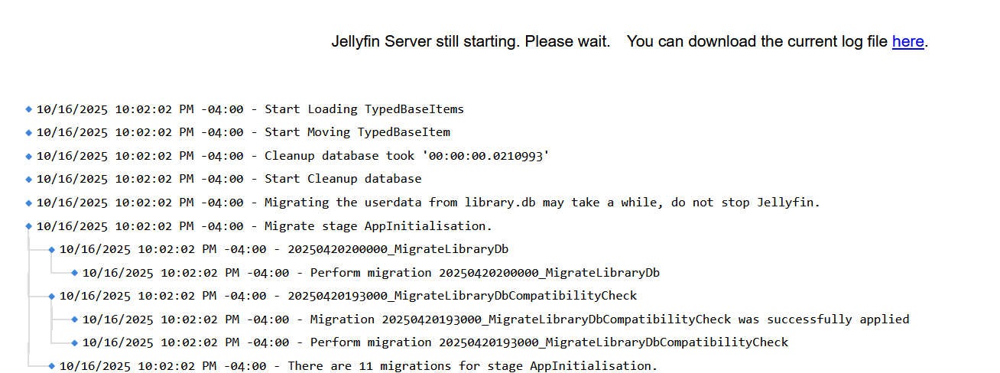
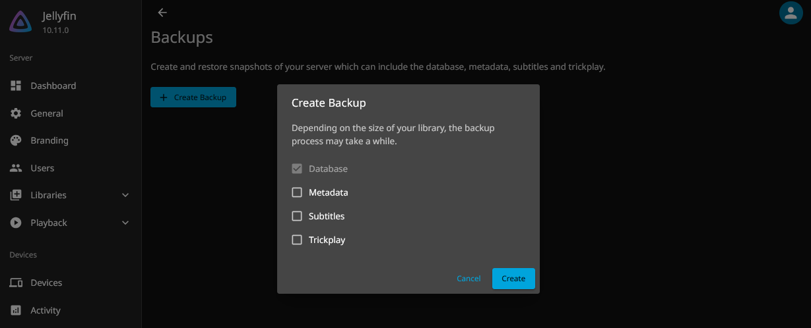

We are pleased to bring you Jellyfin 10.11.0, our new stable release. This is probably one of, if not the, biggest and most impactful releases we've done yet, with some massive backend changes to improve performance and long-term expandability and maintainability. This release has been a long time coming, with over 6 months of development and another 6 months of RC testing, throwing our planned 6-month release schedule completely out of whack, but we definitely think the results are worth it - both for users right now, and for the long-term health of the project.

If you just want a quick summary of what you **need to know** (and you **DO** need to know!) to get your system upgraded and running, please read on to the "TL; DR" section just below, or keep reading for a full explanation of all the major features and improvements in Jellyfin 10.11.0! You can also view full changelogs on the [server](https://github.com/jellyfin/jellyfin/releases/tag/v10.11.0) and [web](https://github.com/jellyfin/jellyfin-web/releases/tag/v10.11.0) GitHub releases.

\- Joshua

{/* truncate */}

## TL; DR

**IT IS VERY IMPORTANT THAT YOU READ THIS SECTION BEFORE UPGRADING TO JELLYFIN 10.11.0!** Failure to do so may cause issues! Always feel free to [ask for help in our chat](/contact) if you are unclear or run into trouble.

1. As always for major upgrades, ensure you **STOP Jellyfin and take a [FULL MANUAL BACKUP OF YOUR DATA AND CONFIG DIRECTORIES](/docs/general/administration/backup-and-restore/#manual-backup) before upgrading**! While the upgrade process _should_ be seamless and has guardrails, we've seen a lot of strange bugs during RC testing and it's better to be safe than sorry.

2. You **MUST** be running Jellyfin 10.10.7 before upgrading to 10.11.0! You **may** be fine with Jellyfin 10.9.11 but this is less-extensively tested. **Upgrading from any other versions is NOT supported and WILL fail**; upgrade to 10.10.7 **first**, then upgrade to 10.11.0.

3. The initial upgrade will include **MULTIPLE LONG-RUNNING MIGRATIONS** that may take up to several hours depending on your library size and state. **DO NOT CANCEL OR INTERRUPT THE SYSTEM** during these migrations; let them run overnight if possible on very large libraries. You can use the new Startup UI and Log Viewer (see below) from your local network to view the progress during the upgrade, and please see the section below for more details on "why".

4. The upgrade will make a backup of your existing `library.db` file named `library.db.old`. This file can be used to recover should the upgrade fail. Once you have successfully upgraded and Jellyfin 10.11.0 is running smoothly, you may delete this backup. If you need to try the migrations again due to a failure, stop Jellyfin, rename this file back to `library.db`, then start Jellyfin again, and the migration will be re-attempted.

5. If you have adjusted the Library Page Size to anything other than the default of 100, we recommend putting it back for performance reasons before upgrading.

6. After upgrading, we strongly recommend running a **full library scan** to ensure that all data is correctly populated. Failure to do so may result in weird bugs if any metadata entries were corrupt or not properly migrated (rare but possible). Additionally, users should also perform a scan for missing metadata on their Music libraries, as this may be necessary for proper music functionality after the upgrade. While it may not be strictly required, performing this additional scan on other libraries is recommended to ensure everything functions correctly.

7. Jellyfin 10.11.0 is **NOT** compatible with 32-bit ARM systems (`armhf`), like 1st and 2nd generation Raspberry Pis or other low-end or old SBCs, or any ARM system running a 32-bit operating system. You **must** be running an ARM64 operating system to run Jellyfin 10.11.0 on ARM systems. See below for more information.

8. This release also fixes several security bugs, both for ourselves and from upstream projects like DotNET. We do recommend upgrading to 10.11.0 **as soon as possible**.

9. As always with major Jellyfin releases, bugs will exist, even after 6 months of RC testing. This is a second reminder to **take a full backup before upgrading**, as this is the only way to downgrade back to a previous version if you find that you need to.

And now on to the cool new features!

## The Library Database conversion to EF Core is complete!

For this one, a bit of backstory is required. For a long time, the backend of Jellyfin has been a mess of spaghetti, as historically pre-Jellyfin very little thought was put into long-term best-practices during development of new features and functionality. This manifested as a codebase completely littered with database calls, written as raw SQLite statements inside of other code, with effectively zero centralization of the database management functionality into an ORM (object-relational model system).

This had three major negative effects: (1) doing any changes to the database schemas required complex, error-prone manual migrations that were bespoke for each change, with little in the way of safeguards or guardrails and no downgrade support; (2) it was very difficult to add new functionality or change existing functionality without rewriting large swaths of unrelated code to take the new changes into account; and (3) it completely locked the system into the file-based SQLite system with no ability to support other database engines.

Enter EF Core, an ORM for .NET and C#, the framework and language Jellyfin is written in, that simplifies and helps manage the database for us, allowing us to remove all this legacy spaghetti and massively simplify the database handling within Jellyfin. It includes things like an automatic migration handler with versioning, standardized interfaces to the database calls, and the flexibility to use other backend database engines in the future.

The initial conversion work was started almost 5 years ago with some of the simpler databases, such as Users and Authentication, but the elephant of the conversion was the Library database: its massive complexity, sprawling reach, and reliance not only on the database but also on static XML files on-disk, meant that it was quite a thing to tackle, and the project stalled out for several years. Cue @JPVenson, who with less than 6 months involved in the project took on this massive project and drove it to completion.

The end result might not seem like much to a normal user: queries do get faster, and future changes should be less error-prone, but mostly this change is transparent. But on the backend and for the continued long-term development of Jellyfin, this is huge. The simplified database access will let us write cleaner, less error-prone code, implement new features, perform complex migrations, and more, much faster and with a minimum of effort, opening up a lot of new opportunities for advancement. We can then finally start tackling the absolutely massive mountain of open feature requests, many of which were nearly impossible before this change. For administrators, it also opens up new possibilities - not officially yet, but soon - for running Jellyfin backed by "real" database systems like PostgreSQL, providing new options for redundancy, load-balancing, and easier maintenance and administration. The future looks very bright!

### Deduplication and Migrations

The core of the migration involves a transfer of all Library data from the legacy `library.db` to the new structures within `jellyfin.db`. While this seems simple on the surface, as part of the conversion process we decided to actively try to improve the schema while we were at it, allowing us to simultaneously clean up a lot of the aforementioned spaghetti code. Thus the migration itself creates proper relational cross-references in the database, including foreign keys, for the first time.

The downside however is that inconsistent and logically corrupt library data is prone to cause problems during the migration, and this has been a source of many issues. The migration must not only restructure the data but fix these logical corruptions and clean up any data that "doesn't make sense" anymore, for example Media items with no parent or duplicated People data for multiple sets of media.

This deduplication and cleanup is very time intensive, and the scale of the cleanup depends heavily on how many logically inconsistent entries are present in the existing database. This essentially means that, the older your database is, and the more logically corrupted entries it has, the more the migration needs to work to clean all of it up, prolonging the migration process. This also makes it very hard to estimate how long the migration can take: a database with 300,000 entries but no issues can migrate in a matter of minutes, while one with just 30 series but severe inconsistencies can take multiple hours.

Thus, when it comes to running the migration, we reiterate letting it run during an off-peak period like overnight, and simply letting it run to completion; if it completes quickly, you're golden, and if not, you will avoid delaying users' access.

### Startup UI and Log Viewer

One nice little feature that grew out of the migration work and the corresponding long-running initial migration was our new Startup UI and Log Viewer. Before this feature, while Jellyfin was starting up and running through e.g. migrations, the system would appear dead - the UI would not load, and it appeared like very little was happening unless you had your log level set to debug. The Startup UI changes this by providing a simple startup WebUI which is only accessible in your configured local networks, and which will display the current status of the startup process and log messages while the system gets ready, giving you more peace of mind about what's going on. For small instances this might not even be visible, but for slow-to-start large instances this can be invaluable for tracking progress and debugging issues.

### Internal Backup & Restore Support

One of the first big benefits of the new backend is a very eagerly-awaited feature: internal, live Backup and Restore support! You can now take a full snapshot of your metadata database, back it up to external storage, and restore from it in the event of a major fault. You can also take regular backups just in case. This will greatly help both normal day-to-day maintenance, as well as upgrades in the future, always knowing that you have a good copy of the data.

The backup and restore system can only restore systems on which the backup was originally made, so this is not a tool to migrate from other OS's or 3rd party containers.

### Aggressive in-memory Database Caching

The new database engine is tuned to aggressively cache metadata in memory, to prevent slow disk reads from bottlenecking the system; this was a frequent problem in previous versions of Jellyfin and a point of regular complaint. In practice, this means that Jellyfin will use more RAM than before, up to the full size of your Library database. This RAM is not wasted however, as the speed-up is very noticeable, especially with large libraries, and the system will try to be as efficient as possible if other tasks require memory. This means that the memory will be given back when other programs need more memory. Be aware of this as you upgrade, as it will look like a lot more resource utilization.

### Improved Locking Behavior

The new database engine also enables several new locking modes; for most users, this is irrelevant, but users with frequent issues related to database locking can now tweak the settings. **More detail about this functionality can be found [in this blog post](/posts/SQLite-locking).**

## Removal of ARM32 (armhf) support

In Jellyfin 10.10.0, we deprecated ARM32 support and have fully removed it from Jellyfin 10.11.0; Jellyfin now requires an ARM64 operating system to run on ARM platforms. In practical terms, this means dropping support for very old or very low-end ARM SBCs (Raspberry Pi 1/2, etc.). We found consistently that these very old SBCs were absolutely terrible at running Jellyfin, even without transcoding, and we decided that dropping support would streamline our release processes and help ensure that users get the best experience out of the box. If you are still running on one of these systems, or on a newer ARM SBC that isn't running a 64-bit operating system, you will need to upgrade your hardware and/or reinstall a 64-bit operating system in order to upgrade to Jellyfin 10.11.0.

## Deprecation of internal TLS/SSL support

We are announcing the deprecation of internal TLS/SSL support in Jellyfin, which we are planning to remove in Jellyfin 10.12.0. The current internal TLS mechanisms are cumbersome and do not integrate well with external systems e.g. Let's Encrypt's `certbot`, which means manual work and manual restarts whenever a certificate needs to be updated. In addition, compiling in TLS support means dependencies on external libraries that complicate our packaged Linux binaries. We have always recommended [running Jellyfin behind a reverse proxy](/docs/general/post-install/networking/reverse-proxy/), all of which provide far better integration for TLS/SSL, so with our next release we will be removing this functionality. For anyone running a production-grade Internet-facing instance using TLS without a reverse proxy, now is the time to get that set up. Even with this removal, we are planning to still provide manual configuration options for the built-in Kestrel TLS system, which would serve as an alternative way to configure TLS, but it will not be exposed through the frontend UX and would be recommended only for very advanced, specific usecases; normal instances should move to reverse proxies.

## Free Space Checks

Jellyfin now actively checks the available free space for its configuration and data directories. If you have less than 2GB of free space in each data directory, Jellyfin now refuses to start to prevent data corruption. Additionally, checks are implemented to prevent certain path misconfigurations that are known to cause issues.

## New Features & Enhancements

We have several new features and enhancements to look forward to:

### User Experience

* Our search performance has been greatly improved, making it much quicker to find what you need.
* The Favorites page will now list Live TV channels, Music Videos, Photo Albums, Photos, and Seasons in addition to the existing media types.
* We now have HEVC decoding support for Firefox 134+. More info is available on the [client support page](/docs/general/clients/codec-support#video-compatibility).
* Native styling of subtitles can be disabled.
* Shows can be displayed grouped in collections when viewing libraries.
* Theme media will now play in random order.
* Guest stars can be assigned roles, e.g., Kelsey Grammer as Captain Morgan Bateson.
* A customizable "splash screen" image can be set as a background on the login page.
* The experimental layout has a redesigned navigation and controls for filtering and sorting libraries.

### Administrator Experience

* The dashboard now displays stats for the number of media items on the server and available storage space.
* Media segment providers can be configured per library similar to other metadata providers.
* AV1 decoding can be enabled for VideoToolbox hardware acceleration.
* M3U tuners can be configured to use the native framerate.
* Branding options are greatly expanded, including "splash screen" image support, extended disclaimer support, and custom CSS; even more is planned for the future to allow administrators to fully customize their user experience to your branding.
* The migration of dashboard pages to our new tech stack is nearly complete with most pages being converted, offering a much simpler and clearer organizational layout.
* When replacing files, Jellyfin will now recognize this and prune related data (chapters, trickplay files and extracted subtitles and attachments) on scan, making sure that these data will be re-generated, matching the new file.

### Transcoding and Media Handling

* We have moved to the new upstream FFmpeg 7.1, which brings many improvements.
* We now support 3D LUT-based HDR tone-mapping on Intel HD/UHD graphics and Rockchip RK3588, improving performance.
* We now support Dolby Vision Profile 5 tone-mapping on Rockchip RK3588.
* We now have more accurate rendering of ASS/SSA subtitles when using hardware transcoding.
* We now support AV1 hardware decoding for Apple VideoToolbox.
* We have improved our dynamic HDR metadata handling, which involves properly detecting HDR10+ videos and selectively removing DoVi or HDR10+ metadata to avoid black screen on devices that only support a single type of dynamic HDR metadata.

## Client Development Changes

The following changes apply to all client application developers. Please review thoroughly and update your applications as required.

### HTTP API

* We've added a new option for developers to test their client with deprecated authorization methods disabled. We're planning to remove old authorization methods in 10.12.0. More details about how to authorize and to test are available in [this document](https://gist.github.com/nielsvanvelzen/ea047d9028f676185832e51ffaf12a6f).
* The `OnPlaybackStart`, `OnPlaybackProgress` and `OnPlaybackStopped` operations are now deprecated. Use the `ReportPlaybackStart`, `ReportPlaybackProgress` and `ReportPlaybackStopped` operations instead, as the former will be removed in a future version.
* A new `GetSystemStorage` operation has been added to retrieve information about the server storage.
* A new `BackupApi` has been added to list, create, and restore backups.
* Lyrics now contain cues to allow timing for individual words.
* Parental ratings have now moved to the new `ratingScore` property which allows for subscores.
* The server may now return `503 Service Unavailable` when a server startup/shutdown/restart is in progress. Clients should expect this code, react to the `Retry-After: sec` header, and retry the operation as needed.

### Plugins

* All database access **must** now be done through EF Core. Raw SQL will no longer be accepted by the server.
* Plugins may now provide custom database access. This is a HIGHLY experimental API and is subject to changes, with a goal of stability in 10.12.0.
* Metadata plugins should use the new interface for external URL providers to supply better naming for external metadata links.

Happy Watching!
