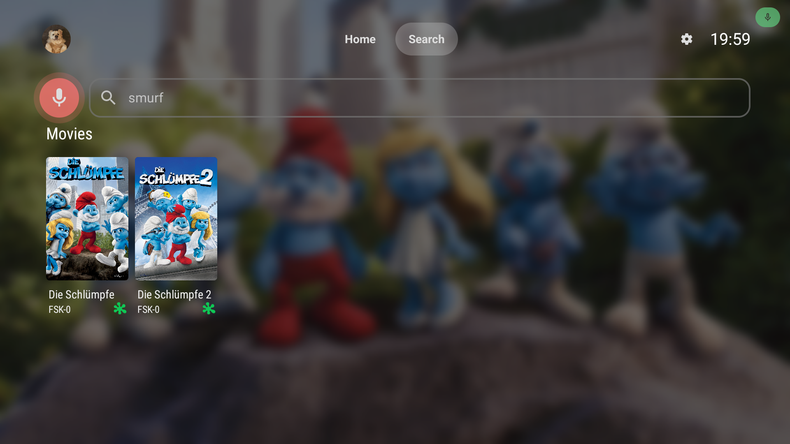
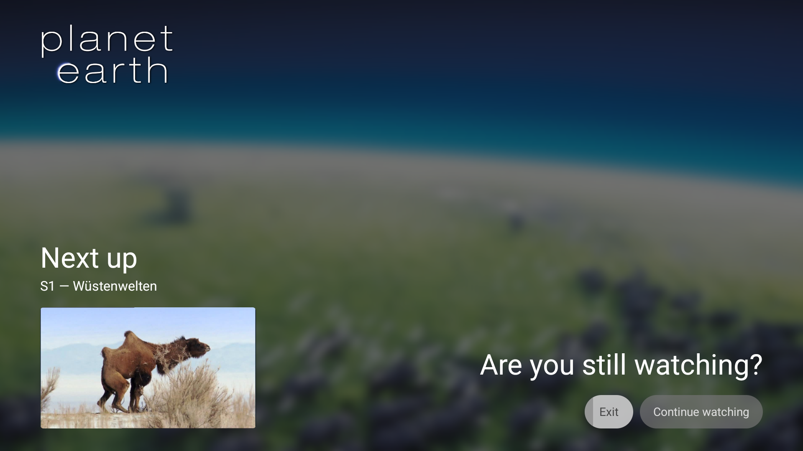
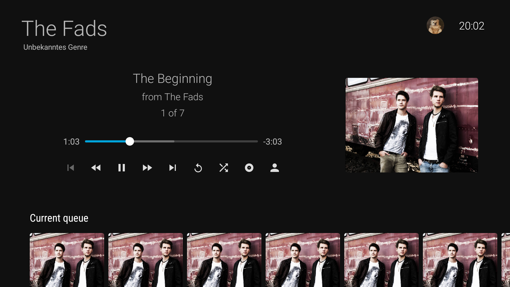
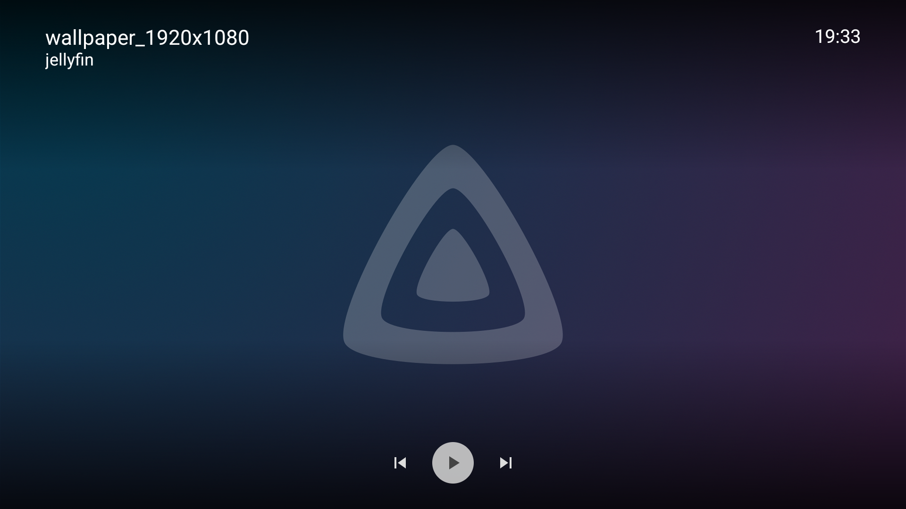

From refreshed user interface elements to playback improvements, there are many changes across the board in the latest update of Jellyfin
for Android TV.

{/* truncate */}

I'm glad to announce a brand new release of Jellyfin for Android TV. This time, we've made progress in many aspects of the app. Some more
visible than others. This blog post will highlight some of the most notable changes. A complete list is available in the
[GitHub changelog](https://github.com/jellyfin/jellyfin-androidtv/releases/tag/v0.19.0).

## 🔍 Search

The search functionality of the app was redesigned based on the new style of the app. This new look also introduces voice search! And
this is only a first step of many to come. Future updates are planned to add search suggestions, in-library search and a revamp of how
results are shown.

## 📺 Are you still watching?

By popular request, we now have a new inactivity popup. When enabled in the app preferences it will ask you if you're still watching TV when
no input has been detected for a configurable amount of time or number of episodes. If you don't choose to continue watching the app will
automatically close the video player, preventing entire series from being marked as watched overnight when you fall asleep!

## 📹 Video

A lot of effort was put into improving our video player. While not all our work was ready for this release yet, a lot of it was. We've
made significant improvements in the detection of device HDR capabilities to more accurately transcode or direct play content. For Dolby
Vision content we do require Jellyfin 10.11 and media has to be rescanned for these changes to fully work. Additionally we now support the
VobSub and DVDSub subtitle formats without transcoding.

To both improve our detection algorithms and help troubleshoot playback issues we added a new troubleshoot mechanic. You'll find a new
button in the advanced playback preferences to send a "media capability report" to the server. This report contains information about your
device and its capabilities, together with the "device profile" that is sent to the Jellyfin server to decide whether transcoding or
remuxing is necessary.

## 🎶 Music

It's now possible to fast forward, rewind or manually seek through your playing music. Various issues with managing the
queue have been fixed, including remote control support.

## 🖼️ Photos

The photo viewer got upgrades with a fresh coat of paint. It now shows the file and album name too, making it easier to see what you're
looking at. This also gives a small glimpse of how the video player will look in the future.

## ✨ Jellyfin 10.11

Jellyfin server version 10.11 just released, but don't be alarmed: this app release supports both Jellyfin 10.10 and 10.11, giving you the
time to upgrade at your own pace. Some features, like the HDR improvement, do rely on Jellyfin 10.11, so upgrading is advised for
the best experience.

## 🫳 Android 5 and below

**The 0.19.x releases will be the last ones supporting Android 5 and Android 5.1** due to updated vendor requirements. Based on our limited
statistics, this affects less than 1% of our users. You will be able to keep using Jellyfin, but won't be able to receive future app
updates. We recommend upgrading your device or using an external Android TV set-top box to receive future app updates.

## Made possible by you

Jellyfin is completely developed by volunteers, and couldn't be made without their great skills and dedication. Consider donating if you
appreciate their work. A big shout-out to all contributors that made this release possible:

**Jellyfin Team**

- [@nielsvanvelzen](https://github.com/nielsvanvelzen) - Donate via [GitHub sponsors](https://github.com/sponsors/nielsvanvelzen) or
  [Buy Me a Coffee](https://buymeacoffee.com/nielsvanvelzen)
- [@BotBlake](https://github.com/BotBlake)
- [@linkandzelda91](https://github.com/linkandzelda91)

**Other contributors**

- [@tal\-sarid](https://github.com/tal-sarid)
- [@dtrexler](https://github.com/dtrexler)
- [@hdweiss](https://github.com/hdweiss)
- [@kylep09](https://github.com/kylep09)
- [@RubenTeixeira](https://github.com/RubenTeixeira)
- [@clams4shoes](https://github.com/clams4shoes)
- [@owochle](https://github.com/owochle)
- [@ferrarimarco](https://github.com/ferrarimarco)
- [@conihorse](https://github.com/conihorse)
- [@ConnorS1110](https://github.com/ConnorS1110)
- [@vahtos](https://github.com/vahtos)
- [@claireratigan](https://github.com/claireratigan)
- [@cani1see](https://github.com/cani1see)
- [@osiris86](https://github.com/osiris86)
- [@bin101](https://github.com/bin101)
- [@EMohlin7](https://github.com/EMohlin7)
- [@mkst](https://github.com/mkst)

And finally a big thank you to everyone who contributed translations, reported bugs, provided feedback and participated in beta testing!

### Helping out

If you have experience with Android TV development or with Kotlin and are interested in contributing yourself, feel free to dive into the
[source code](https://github.com/jellyfin/jellyfin-androidtv) and open a pull request. Alternatively, you can help with translating the app
into your own language on our [Weblate](https://translate.jellyfin.org/engage/jellyfin-android/) instance.

## Downloads

Update your app now to check out all these changes! The app stores will auto-update your Jellyfin app if you're already using the app. For
new users, you can find the app on the app store of your platform.

Direct downloads are available at [repo.jellyfin.org](https://repo.jellyfin.org/releases/client/androidtv/) or in the
[GitHub release](https://github.com/jellyfin/jellyfin-androidtv/releases/latest).

You can also join our [beta program on Google Play](https://play.google.com/apps/testing/org.jellyfin.androidtv) and help test new versions
before they're released to the public. [Read more](../../2021/07-24-android-betas.mdx) about our beta program.
