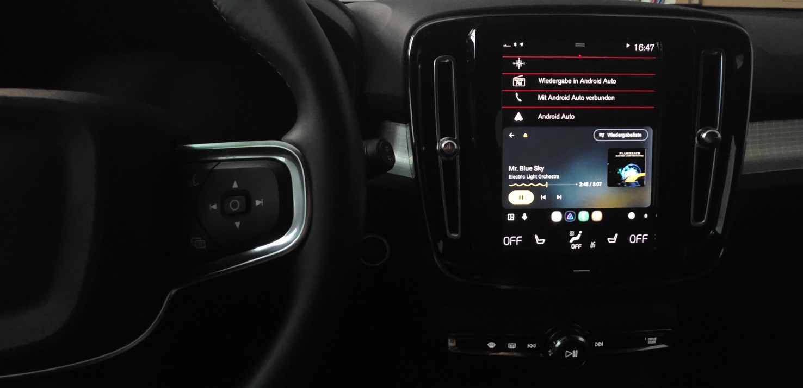

We're excited to announce the release of **Jellyfin for Android 2.7**! This release introduces one of the largest updates to the app so
far, with a completely redesigned downloads experience, revamped Android Auto support, major playback improvements, and many bug fixes and
quality-of-life enhancements.

{/* truncate */}

Thank you to everyone who contributed code, tested beta releases, reported bugs, and helped improve the app throughout this release cycle.

import androidDownloadDemoPng from './android-download-demo.png';

  

## Redesigned downloads

The download functionality of the app was completely redesigned, adding many new features and making your downloads fully manageable in-app.
It is now possible to see all your downloads inside the app and play them. Video files are played with the app's own video player, other
media types will open in a compatible external app. The first time you download something, the app will ask you to choose a folder to store
all your downloads in. Unfortunately, your existing downloads cannot be migrated.

And this is only the start! We're planning to add better filtering and browsing of your downloads and improved offline support where your
watch state will be synchronized with the server once you're back online.

  

  

    
  

## Android Auto support

Android Auto support has long been one of the Jellyfin app's most popular features, making it easy to enjoy your music while on the go. This
release brings a major overhaul to the Android Auto support. You can now browse your large music libraries without being limited to just 250
results. We've also improved the search and, perhaps most excitingly, added support for audiobooks!

To achieve these changes the Android Auto integration was completely rewritten from the ground up. This makes it easier to maintain and
expand with more features in future releases.

## Better playback

Hidden in the app's settings is an option to change the app's video player implementation. Until now, this has always been set to the "web"
player. This was mainly because we weren't confident yet that our "native" video player was ready for everyone. Starting with version 2.7,
that's changing. The native video player is now the default, allowing for more efficient playback and reducing the need for transcoding.

The native video player also received several improvements. It now supports TrickPlay images while scrubbing, includes a gesture to quickly
seek forward or backward in your video, supports media segments for skipping, and has a better fallback mechanism when a video fails to
play.

## Android improvements

Version 2.7 now targets **Android 16 (SDK 36)** and supports Android's per-app language preferences, allowing Jellyfin to use a different
language than the rest of your device. We've also ensured the app is compatible with the recently released Android 17. Other improvements
include better codec detection for direct playback and enhancements to the "now playing" notification.

## Android 5 and below

**This release will be the last to support Android 5 and Android 5.1** due to updated vendor requirements. Based on our limited statistics,
this affects fewer than 1% of our users. You'll still be able to use Jellyfin, but won't be able to receive future app updates. We recommend
upgrading your device to receive future app updates.

## Made possible by you

Jellyfin is completely developed by volunteers, and couldn't be made without their great skills and dedication. Consider donating if you
appreciate their work. A big shout-out to all contributors that made this release possible:

**Jellyfin Team**

- [@nielsvanvelzen](https://github.com/nielsvanvelzen) - Donate via [Buy Me a Coffee](https://buymeacoffee.com/nielsvanvelzen) or
  [GitHub sponsors](https://github.com/sponsors/nielsvanvelzen)
- [@Maxr1998](https://github.com/Maxr1998) - Donate via [GitHub sponsors](https://github.com/sponsors/Maxr1998)
- [@BotBlake](https://github.com/BotBlake) - Donate via [GitHub sponsors](https://github.com/sponsors/BotBlake)
- [@thedreaddpirate](https://github.com/thedreaddpirate) - Donate via [GitHub sponsors](https://github.com/sponsors/thedreaddpirate)

**Other contributors**

{/* cspell:disable */}

- [@3flex](https://github.com/3flex)
- [@CeruleanRed](https://github.com/CeruleanRed)
- [@7ritn](https://github.com/7ritn)
- [@comp500](https://github.com/comp500)
- [@Ank1996](https://github.com/Ank1996)
- [@Tukajo](https://github.com/Tukajo)
- [@lfranke42](https://github.com/lfranke42)
- [@jakobkukla](https://github.com/jakobkukla)
- [@s12f](https://github.com/s12f)
- [@miikaforma](https://github.com/miikaforma)
- [@cameocoder](https://github.com/cameocoder)
- [@gert7](https://github.com/gert7)
- [@RonDen\-DidIt](https://github.com/RonDen-DidIt)
- [@TheMrMilchmann](https://github.com/TheMrMilchmann)
- [@rodis120](https://github.com/rodis120)
- [@jagadam97](https://github.com/jagadam97)
- [@VTRunner](https://github.com/VTRunner)
- [@SJJ\-dot](https://github.com/SJJ-dot)
- [@DevGitPit](https://github.com/DevGitPit)
- [@kfarnung](https://github.com/kfarnung)
- [@GeiserX](https://github.com/GeiserX)
- [@tal\-sarid](https://github.com/tal-sarid)
- [@stumpylog](https://github.com/stumpylog)
- [@mherceg](https://github.com/mherceg)
- [@jim\-daf](https://github.com/jim-daf)
- [@jordanmichaelrushing](https://github.com/jordanmichaelrushing)
- [@JDStriker456](https://github.com/JDStriker456)

{/* cspell:enable */}

 

And finally a big thank you to everyone who contributed translations, reported bugs, provided feedback and participated in beta testing!

### Helping out

If you have experience with Android development or with Kotlin and are interested in contributing yourself, feel free to dive into the
[source code](https://github.com/jellyfin/jellyfin-android) and open a pull request. Alternatively, you can help with translating the app
into your own language on our [Weblate](https://translate.jellyfin.org/engage/jellyfin-android/) instance.

## Downloads

Update your app now to check out all these changes! The app stores will auto-update your Jellyfin app if you're already using the app. For
new users, you can find the app on the app store of your platform.

Direct downloads are available at [repo.jellyfin.org](https://repo.jellyfin.org/releases/client/android/) or in the
[GitHub release](https://github.com/jellyfin/jellyfin-android/releases/latest).

You can also join our [beta program on Google Play](https://play.google.com/apps/testing/org.jellyfin.mobile) and help test new versions
before they're released to the public. [Read more](../../2021/07-24-android-betas.mdx) about our beta program.
