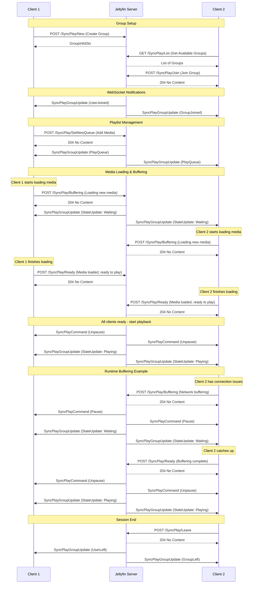

# Jellyfin SyncPlay API Documentation

SyncPlay allows multiple users to synchronize their media playback in real-time. This document outlines the WebSocket
messages and provides links to the REST API documentation for SyncPlay functionality.

## Overview

SyncPlay uses a combination of REST API endpoints for control actions and WebSocket messages for real-time
synchronization.

## REST API Endpoints

For detailed information about all SyncPlay REST API endpoints, including request/response schemas and examples, see
the [official Jellyfin API documentation](https://api.jellyfin.org/#tag/SyncPlay).

### Quick Reference Links

**Group Management:**

- [Create Group](https://api.jellyfin.org/#tag/SyncPlay/operation/SyncPlayCreateGroup) - `POST /SyncPlay/New`  
  Creates a new SyncPlay group with a custom name. Use this when you want to start a new synchronized viewing session
  and invite others to join.

- [Join Group](https://api.jellyfin.org/#tag/SyncPlay/operation/SyncPlayJoinGroup) - `POST /SyncPlay/Join`  
  Joins an existing SyncPlay group by ID. Use this to participate in someone else's synchronized viewing session.

- [Leave Group](https://api.jellyfin.org/#tag/SyncPlay/operation/SyncPlayLeaveGroup) - `POST /SyncPlay/Leave`  
  Leaves your current SyncPlay group. Call this when you want to stop participating in the synchronized session.

- [List Groups](https://api.jellyfin.org/#tag/SyncPlay/operation/SyncPlayGetGroups) - `GET /SyncPlay/List`  
  Gets all available SyncPlay groups you can join. Use this to browse active groups before joining one.

- [Get Group](https://api.jellyfin.org/#tag/SyncPlay/operation/SyncPlayGetGroup) - `GET /SyncPlay/{id}`  
  Gets basic information about a specific group (name, state, participants).

**Playlist Management:**

- [Set New Queue](https://api.jellyfin.org/#tag/SyncPlay/operation/SyncPlaySetNewQueue) - `POST /SyncPlay/SetNewQueue`  
  Replaces the entire group playlist with new media items. Use this to start watching something completely different or
  create a new viewing queue.

- [Set Playlist Item](https://api.jellyfin.org/#tag/SyncPlay/operation/SyncPlaySetPlaylistItem) - `POST /SyncPlay/SetPlaylistItem`  
  Jumps to a specific item in the current playlist. Use this to skip to a particular episode or movie in the queue.

- [Remove From Playlist](https://api.jellyfin.org/#tag/SyncPlay/operation/SyncPlayRemoveFromPlaylist) - `POST /SyncPlay/RemoveFromPlaylist`  
  Removes specific items from the playlist or clears the entire queue. Use this to remove unwanted content or start
  fresh.

- [Move Playlist Item](https://api.jellyfin.org/#tag/SyncPlay/operation/SyncPlayMovePlaylistItem) - `POST /SyncPlay/MovePlaylistItem`  
  Reorders items in the playlist by moving an item to a new position. Use this to reorganize the viewing order.

- [Queue Items](https://api.jellyfin.org/#tag/SyncPlay/operation/SyncPlayQueue) - `POST /SyncPlay/Queue`  
  Adds new items to the existing playlist (append or insert next). Use this to add more content without replacing what's
  already queued.

**Playback Control:**

- [Unpause](https://api.jellyfin.org/#tag/SyncPlay/operation/SyncPlayUnpause) - `POST /SyncPlay/Unpause`  
  Resumes playback for all group members simultaneously.

- [Pause](https://api.jellyfin.org/#tag/SyncPlay/operation/SyncPlayPause) - `POST /SyncPlay/Pause`  
  Pauses playback for all group members simultaneously.

- [Stop](https://api.jellyfin.org/#tag/SyncPlay/operation/SyncPlayStop) - `POST /SyncPlay/Stop`  
  Stops playback for all group members.

- [Seek](https://api.jellyfin.org/#tag/SyncPlay/operation/SyncPlaySeek) - `POST /SyncPlay/Seek`  
  Jumps to a specific time position for all group members. Use this to skip intros, or jump to specific moments.

- [Next Item](https://api.jellyfin.org/#tag/SyncPlay/operation/SyncPlayNextItem) - `POST /SyncPlay/NextItem`  
  Skips to the next item in the playlist for all group members. Use this to move to the next episode or movie.

- [Previous Item](https://api.jellyfin.org/#tag/SyncPlay/operation/SyncPlayPreviousItem) - `POST /SyncPlay/PreviousItem`  
  Goes back to the previous item in the playlist for all group members. Use this to rewatch the previous episode or
  movie.

**Playback Settings:**

- [Set Repeat Mode](https://api.jellyfin.org/#tag/SyncPlay/operation/SyncPlaySetRepeatMode) - `POST /SyncPlay/SetRepeatMode`  
  Changes how the playlist repeats (None, RepeatOne, RepeatAll). Use this to control what happens when the playlist
  ends.

- [Set Shuffle Mode](https://api.jellyfin.org/#tag/SyncPlay/operation/SyncPlaySetShuffleMode) - `POST /SyncPlay/SetShuffleMode`  
  Toggles shuffle mode for the playlist (Sorted, Shuffled). Use this to randomize the viewing order or return to
  sequential playback.

**Session Management:**

- [Buffering](https://api.jellyfin.org/#tag/SyncPlay/operation/SyncPlayBuffering) - `POST /SyncPlay/Buffering`  
  Notifies the group that your client is buffering. The group will wait for you to catch up. Use this when your
  connection is slow or you're experiencing playback issues.

- [Ready](https://api.jellyfin.org/#tag/SyncPlay/operation/SyncPlayReady) - `POST /SyncPlay/Ready`  
  Notifies the group that your client is ready to continue. Use this after buffering is complete or when you're ready to
  resume synchronized playback.

- [Set Ignore Wait](https://api.jellyfin.org/#tag/SyncPlay/operation/SyncPlaySetIgnoreWait) - `POST /SyncPlay/SetIgnoreWait`  
  Tells the group whether to wait for you during buffering events. Set to true if you have a slow connection and don't
  want to hold up the group.

- [Ping](https://api.jellyfin.org/#tag/SyncPlay/operation/SyncPlayPing) - `POST /SyncPlay/Ping`  
  Updates your network latency information for better synchronization. The client should call this periodically to
  maintain accurate timing.

## WebSocket Messages

### Outbound Messages (Server → Client)

#### SyncPlayCommand

- **Message Type:** `SyncPlayCommand`
- **Payload:** [`SendCommand`](https://github.com/jellyfin/jellyfin/blob/master/MediaBrowser.Model/SyncPlay/SendCommand.cs)
- **Description:** Sends playback commands to clients

**Field Descriptions:**

- **`GroupId`** - The unique identifier of the SyncPlay group.

- **`PlaylistItemId`** - The unique identifier for the specific playlist item being controlled.

- **`When`** - The exact UTC timestamp when the command should be executed. This is crucial for synchronization - all
  clients execute the command at the same moment to stay in sync, accounting for network latency.

- **`PositionTicks`** - The target playback position in ticks (1 tick = 100 nanoseconds) Used for Seek commands to
  specify where to jump to, or for Pause/Unpause to ensure all clients are at the same position. Null for Stop commands.

- **`Command`** - The action to perform: `"Pause"`, `"Unpause"`, `"Stop"`, or `"Seek"`. This tells the client's media
  player what operation to execute.

- **`EmittedAt`** - UTC timestamp when the server created this command.

**Example JSON Payload:**

*Pause Command:*

```json
{
  "MessageId": "913c6c648a2a4cd8a5c272936d330786",
  "Data": {
    "GroupId": "9eaabe0fae4c4428aec654e682381c5a",
    "PlaylistItemId": "23bb3d883e7447bd9f125c76079ef7f9",
    "When": "2025-10-23T14:41:51.5453813Z",
    "PositionTicks": 207510114,
    "Command": "Pause",
    "EmittedAt": "2025-10-23T14:41:51.5453888Z"
  },
  "MessageType": "SyncPlayCommand"
}
```

#### SyncPlayGroupUpdate

- **Message Type:** `SyncPlayGroupUpdate`
- **Payload:** [`GroupUpdate<T>`](https://github.com/jellyfin/jellyfin/blob/master/MediaBrowser.Model/SyncPlay/GroupUpdate.cs)
- **Description:** Sends group state updates to clients

**Common Fields (All Update Types):**

- **`MessageId`** - Unique identifier for this WebSocket message. Used for debugging and tracking message delivery.

- **`MessageType`** - Always `"SyncPlayGroupUpdate"` for group updates. Tells the client this is a group state change
  notification.

- **`GroupId`** - The unique identifier of the SyncPlay group affected by this update.

- **`Type`** - The specific type of group update (see sections below for details).

- **`Data`** - The update-specific payload containing relevant information for this update type.

---

##### UserJoined Update

- **Type:** `UserJoined`
- **Payload:** [`SyncPlayUserJoinedUpdate`](https://github.com/jellyfin/jellyfin/blob/master/MediaBrowser.Model/SyncPlay/SyncPlayUserJoinedUpdate.cs)
- **Description:** Notifies existing group members that a new user has joined

**Data Fields:**

- **`Data`** (string) - The username of the user who joined the group. Display this in your UI to show other
  participants who joined.

**Example JSON:**

```json
{
  "MessageId": "ef41c46c72624f4b898a152983281542",
  "Data": {
    "GroupId": "9f69bd109fbd4ef097853fc7b6c7707a",
    "Type": "UserJoined",
    "Data": "JohnDoe"
  },
  "MessageType": "SyncPlayGroupUpdate"
}
```

---

##### UserLeft Update

- **Type:** `UserLeft`
- **Payload:** [`SyncPlayUserLeftUpdate`](https://github.com/jellyfin/jellyfin/blob/master/MediaBrowser.Model/SyncPlay/SyncPlayUserLeftUpdate.cs)
- **Description:** Notifies remaining group members that a user has left

**Data Fields:**

- **`Data`** (string) - The username of the user who left the group. Update your UI to remove this participant from the
  display.

**Example JSON:**

```json
{
  "MessageId": "5b97987e8ba7499ba68c680efdda9493",
  "Data": {
    "GroupId": "9f69bd109fbd4ef097853fc7b6c7707a",
    "Type": "UserLeft",
    "Data": "JohnDoe"
  },
  "MessageType": "SyncPlayGroupUpdate"
}
```

---

##### GroupJoined Update

- **Type:** `GroupJoined`
- **Payload:** [`SyncPlayGroupJoinedUpdate`](https://github.com/jellyfin/jellyfin/blob/master/MediaBrowser.Model/SyncPlay/SyncPlayGroupJoinedUpdate.cs)
- **Description:** Confirms to the current user that they successfully joined a group

**Data Fields:**

- **`Data`** ([`GroupInfoDto`](https://github.com/jellyfin/jellyfin/blob/master/MediaBrowser.Model/SyncPlay/GroupInfoDto.cs)) -
  Complete group information including name, participants, and current state.

**Example JSON:**

```json
{
  "MessageId": "4972c0054cde4b359c93d86c3113dc5a",
  "Data": {
    "GroupId": "9f69bd109fbd4ef097853fc7b6c7707a",
    "Type": "GroupJoined",
    "Data": {
      "GroupId": "9f69bd109fbd4ef097853fc7b6c7707a",
      "GroupName": "Movie Night",
      "State": "Idle",
      "Participants": [
        "JohnDoe"
      ],
      "LastUpdatedAt": "2025-10-23T16:57:27.266302Z"
    }
  },
  "MessageType": "SyncPlayGroupUpdate"
}
```

---

##### GroupLeft Update

- **Type:** `GroupLeft`
- **Payload:** [`SyncPlayGroupLeftUpdate`](https://github.com/jellyfin/jellyfin/blob/master/MediaBrowser.Model/SyncPlay/SyncPlayGroupLeftUpdate.cs)
- **Description:** Confirms to the current user that they have left the group

**Data Fields:**

- **`Data`** - Same as the GroupId. This message serves as confirmation that you're no longer in the group.

**Example JSON:**

```json
{
  "MessageId": "76034684b83a4bc0affc09afd1d995f7",
  "Data": {
    "GroupId": "9f69bd109fbd4ef097853fc7b6c7707a",
    "Type": "GroupLeft",
    "Data": "9f69bd109fbd4ef097853fc7b6c7707a"
  },
  "MessageType": "SyncPlayGroupUpdate"
}
```

---

##### StateUpdate

- **Type:** `StateUpdate`
- **Payload:** [`SyncPlayStateUpdate`](https://github.com/jellyfin/jellyfin/blob/master/MediaBrowser.Model/SyncPlay/SyncPlayStateUpdate.cs)
- **Description:** Notifies when the group's playback state changes (Playing, Paused, Waiting, Idle)

**Data Fields:**

- **`State`** ([`GroupStateType`](https://github.com/jellyfin/jellyfin/blob/master/MediaBrowser.Model/SyncPlay/GroupStateType.cs)) -
  The new group state: `Idle`, `Waiting`, `Paused`, or `Playing`
- **`Reason`** ([`PlaybackRequestType`](https://github.com/jellyfin/jellyfin/blob/master/MediaBrowser.Model/SyncPlay/PlaybackRequestType.cs)) -
  What caused the state change (e.g., user action, buffering)

**Example JSON:**

```json
{
  "MessageId": "13df5d11081143809ba938e0f73cb86d",
  "Data": {
    "GroupId": "9f69bd109fbd4ef097853fc7b6c7707a",
    "Type": "StateUpdate",
    "Data": {
      "State": "Waiting",
      "Reason": "Buffering"
    }
  },
  "MessageType": "SyncPlayGroupUpdate"
}
```

---

##### PlayQueue Update

- **Type:** `PlayQueue`
- **Payload:** [`SyncPlayPlayQueueUpdate`](https://github.com/jellyfin/jellyfin/blob/master/MediaBrowser.Model/SyncPlay/SyncPlayPlayQueueUpdate.cs)
- **Description:** Provides the complete current playlist when joining a group or when the playlist changes

**Data Fields:**

- **`Reason`** ([`PlayQueueUpdateReason`](https://github.com/jellyfin/jellyfin/blob/master/MediaBrowser.Model/SyncPlay/PlayQueueUpdateReason.cs)) -
  Why the playlist was updated (NewPlaylist, Queue, RemoveItems, etc.)
- **`LastUpdate`** - UTC timestamp when the playlist was last modified
- **`Playlist`** - Array of [`SyncPlayQueueItem`](https://github.com/jellyfin/jellyfin/blob/master/MediaBrowser.Model/SyncPlay/SyncPlayQueueItem.cs)
  objects representing the complete playlist
- **`PlayingItemIndex`** - Index of the currently playing item in the playlist (-1 if none)
- **`StartPositionTicks`** - Current playback position in ticks
- **`IsPlaying`** - Whether the group is currently playing (true) or paused (false)
- **`ShuffleMode`** - Current shuffle setting (`Sorted` or `Shuffled`)
- **`RepeatMode`** - Current repeat setting (`RepeatNone`, `RepeatAll`, or `RepeatOne`)

**Example JSON:**

```json
{
  "MessageId": "06ae491d134d4564992d6a85f9f863b2",
  "Data": {
    "GroupId": "9f69bd109fbd4ef097853fc7b6c7707a",
    "Type": "PlayQueue",
    "Data": {
      "Reason": "NewPlaylist",
      "LastUpdate": "2025-10-23T16:57:33.5585636Z",
      "Playlist": [
        {
          "ItemId": "b898b4c321ac3d44e1ee1fd893d5c256",
          "PlaylistItemId": "62e047cfe6d5417d8c487bddec5b5071"
        },
        {
          "ItemId": "874a484140b0dd6f9e3365b8fc2ed67f",
          "PlaylistItemId": "d8335ba388ac4c9cb5035e7c9fdea9ec"
        }
      ],
      "PlayingItemIndex": 0,
      "StartPositionTicks": 0,
      "IsPlaying": false,
      "ShuffleMode": "Sorted",
      "RepeatMode": "RepeatNone"
    }
  },
  "MessageType": "SyncPlayGroupUpdate"
}
```

---

### Inbound Messages (Client → Server)

SyncPlay doesn't have dedicated inbound WebSocket message types. All client interactions go through the REST API
endpoints, which then trigger WebSocket notifications to synchronize all group members.

## SyncPlay Flow Diagram

The following diagram shows a typical SyncPlay session flow between two clients:



## Key Concepts

### Group States

- **Idle** - No media is playing
- **Waiting** - Waiting for all members to be ready
- **Paused** - Media is paused
- **Playing** - Media is actively playing

### Synchronization

- All playback commands (play, pause, seek) are synchronized across group members
- The server coordinates timing to ensure all clients stay in sync
- Buffering states are communicated to prevent desynchronization
- Network latency is compensated using ping measurements

### Access Control

- Users must have appropriate SyncPlay permissions
- Library access is enforced (users can only sync content they have access to)

### Ping Management

- **Frequency:** Clients should send ping updates every 60 seconds (1 minute)
- **Endpoint:** [POST /SyncPlay/Ping](https://api.jellyfin.org/#tag/SyncPlay/operation/SyncPlayPing)
- **Purpose:** Network latency measurement for precise synchronization timing

**Why Ping is Critical:**

- **Timing Coordination** - Commands like Unpause are scheduled with delays based on the highest ping in the group

**How to Measure Ping Time:**

Clients must calculate their own round-trip time to the Jellyfin server.

**Recommended Method:**

```javascript
async function measureAndSendPing() {
    const startTime = Date.now();

    await fetch('/System/Ping');

    const pingTime = Date.now() - startTime;

    await fetch('/SyncPlay/Ping', {
        method: 'POST',
        headers: {
            'Authorization': 'MediaBrowser Token="your-auth-token"',
            'Content-Type': 'application/json'
        },
        body: JSON.stringify({Ping: pingTime})
    });

    return pingTime;
}

// Call this function every 60 seconds while in a SyncPlay group
setInterval(measureAndSendPing, 60000);
```

**Implementation Requirements:**

- Send ping requests every 60 seconds while in a SyncPlay group
- Measure actual round-trip time before sending the ping update
- Use the measured ping time in the payload (not a placeholder)
- Continue pinging throughout the entire SyncPlay session
- Stop pinging when leaving the group

**Example Ping Payload:**

```json
{
  "Ping": 45
}
```

Where `Ping` is the measured round-trip time in milliseconds from your client to the Jellyfin server.
